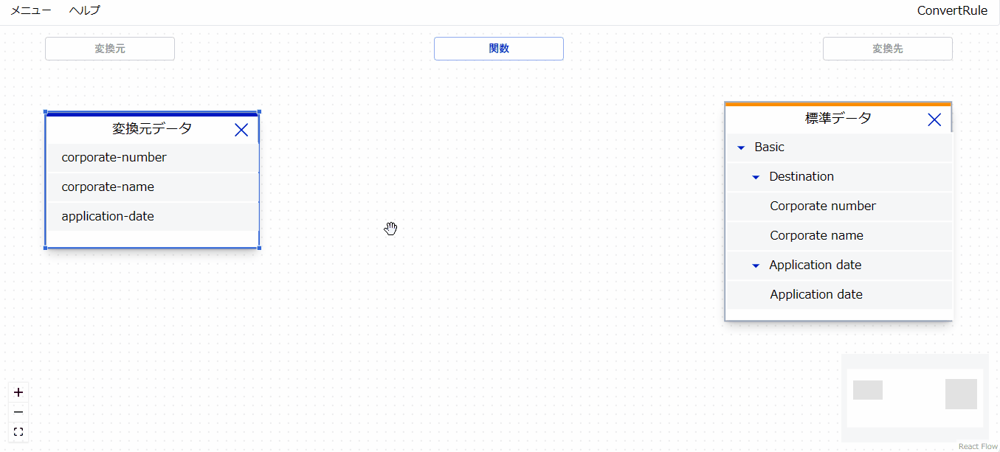
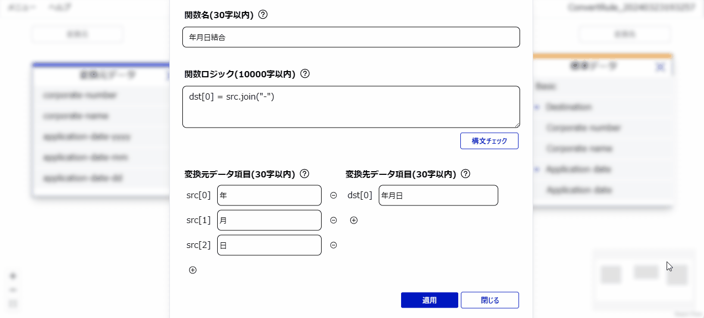

# Data Mapping Tool

## 1. Data Mapping Toolについて
### 1.1. プロダクト概要
本ツールは、REST APIのレスポンス等、JSONのデータを異なる任意のJSONのデータにGUIでマッピングできるツールです。
本ツールを利用することで、REST APIのリクエスト／レスポンスデータを[政府相互運用性フレームワーク (GIF)](https://www.digital.go.jp/policies/data_strategy_government_interoperability_framework/)
を参照した形式に変換することができます。

システム間でやり取りされるデータが共通のルールで標準化されると、データ連携によるデータの利活用が行いやすい状態となり、新たなサービスとの連携や価値創造が生まれることが期待できます。


### 1.2. 推奨環境
#### 1.2.1. 実行環境
| # | 実行環境 |
| - | - |
| 1 | Red Hat Enterprise Linux9 |
| 2 | Ubuntu Server 22.04 LTS |
| 3 | Windows10 |
| 4 | macOS Sonoma 14.3 |

#### 1.2.2. 推奨ブラウザ
| # | 推奨ブラウザ |
| - | - |
| 1 | Microsoft Edge |
| 2 | Google Chrome |
| 3 | Safari  |


## 2. 導入手順

### 2.1. インストール手順 (Redhat)

#### 2.1.1. 前提パッケージのインストール

##### Node.jsのインストール
Node.js(20.11.1 <= version < 21.0.0)をインストールしてください。
```Shell
sudo yum install nodejs
```
##### yarnのインストール
```Shell
npm install -g yarn
```

#### 2.1.2. Data Mapping Toolのダウンロード
gitコマンドでgithubからData Mapping Toolのソースコードをクローンします。
```
git clone https://github.com/gbizconnect/data-mapping.git
```

#### 2.1.3. 依存ライブラリのインストール
```Shell
cd data-mapping
yarn install
```
prismaのインストールと初期化
```Shell
yarn workspace backend prisma migrate dev --name init
```

#### 2.1.4. ビルド
```
yarn workspace frontend build
```
以上でインストールは完了です。

#### 2.1.5. 起動
```
yarn workspace backend start
```
http://localhost:3000/ にアクセスしてください。


### 2.2. インストール手順 (Ubuntu)

#### 2.2.1. 前提パッケージのインストール

##### Node.jsのインストール
Node.js(20.11.1 <= version < 21.0.0)をインストールしてください。
```Shell
sudo apt-get install nodejs
```

##### yarnのインストール
```Shell
npm install -g yarn
```

#### 2.2.2. Data Mapping Toolのダウンロード
gitコマンドでgithubからData Mapping Toolのソースコードをクローンします。
```
git clone https://github.com/gbizconnect/data-mapping.git
```

#### 2.2.3. 依存ライブラリのインストール
```Shell
cd data-mapping
yarn install
```

prismaのインストールと初期化
```Shell
yarn workspace backend prisma migrate dev --name init
```

#### 2.2.4. ビルド
```
yarn workspace frontend build
```
以上でインストールは完了です。

#### 2.2.5. 起動

```
yarn workspace backend start
```
http://localhost:3000/ にアクセスしてください。


### 2.3. インストール手順 (Macintosh)
#### 2.3.1. 前提パッケージのインストール

##### Node.jsのインストール
Node.js(20.11.1 <= version < 21.0.0)をインストールしてください。
```Shell
sudo apt-get install nodejs npm
```

##### yarnのインストール
```Shell
npm install -g yarn
```

#### 2.3.2. Data Mapping Toolのダウンロード
gitコマンドでgithubからData Mapping Toolのソースコードをクローンします。
```
git clone https://github.com/gbizconnect/data-mapping.git
```

#### 2.3.3. 依存ライブラリのインストール
```Shell
cd data-mapping
yarn install
```

prismaのインストールと初期化
```Shell
yarn workspace backend prisma migrate dev --name init
```

#### 2.3.4. ビルド
```Shell
yarn workspace frontend build
```
以上でインストールは完了です。

#### 2.3.5. 起動

```Shell
yarn workspace backend start
```
http://localhost:3000/ にアクセスしてください。


### 2.4. インストール手順 (Windows)
#### 2.4.1. 前提パッケージのインストール

##### Node.jsのインストール
[Node.js](https://nodejs.org/en/download)(20.11.1 <= version < 21.0.0)をダウンロードし、インストールしてください。


##### yarnのインストール
コマンドプロンプトから以下を実行しyarnをインストールしてください。
```Shell
npm install -g yarn
```

#### 2.4.2. Data Mapping Toolのダウンロード
gitコマンドでgithubからData Mapping Toolのソースコードをクローンします。
```Shell
git clone https://github.com/gbizconnect/data-mapping.git
```

#### 2.4.3. 依存ライブラリのインストール
```Shell
cd data-mapping
yarn install
```


#### 2.4.4. ORM(Object-relational mapping)ライブラリをインストール
ORM(Object-relational mapping)PrismaをインストールしDataBaseを初期化します。
コマンドプロンプトで以下コマンドを実行してください。

```Shell
set NODE_TLS_REJECT_UNAUTHORIZED=0
npm config set strict-ssl false
yarn config set "strict-ssl" false -g
yarn workspace backend install
yarn workspace backend prisma generate
yarn workspace backend prisma migrate dev --name init
```

#### 2.4.5. ビルド
```Shell
yarn workspace frontend build
```
以上でインストールは完了です。

#### 2.4.6. 起動
```Shell
yarn workspace backend start
```
http://localhost:3000/ にアクセスしてください。

### 2.5. 依存ライブラリ
Data Mapping Toolでは以下のライブラリを使用しています。

| # | 依存ライブラリ |
| - | - |
| 1 | @nestjs/serve-static |
| 2 | @radix-ui/react-alert-dialog |
| 3 | @radix-ui/react-checkbox |
| 4 | @radix-ui/react-dialog |
| 5 | @radix-ui/react-dropdown-menu |
| 6 | @radix-ui/react-icons |
| 7 | @radix-ui/react-label |
| 8 | @radix-ui/react-menubar |
| 9 | @radix-ui/react-toast |
| 10 | @radix-ui/react-toolbar |
| 11 | @radix-ui/themes |
| 12 | @reactflow/node-resizer |
| 13 | class-variance-authority |
| 14 | clsx |
| 15 | lodash |
| 16 | lucide-react |
| 17 | react |
| 18 | react-dom |
| 19 | react-popper-tooltip |
| 20 | reactflow |
| 21 | tailwind-merge |
| 22 | tailwindcss |
| 23 | @nestjs/common |
| 24 | @nestjs/core |
| 25 | @nestjs/platform-express |
| 26 | @nestjs/swagger |
| 27 | @prisma/client |
| 28 | class-transformer |
| 29 | class-validator |
| 30 | reflect-metadata |
| 31 | rxjs |
| 32 | uuid |


## 3. 使い方

### 3.1. マッピング対象の選択

自身のAPIのレスポンスデータを、法人標準データに変換したい場合を例に示します。
法人標準データについては、「[gBizConnect NodeのGitHub](https://github.com/gbizconnect/gbizconnect-node)」を参照してください。

1. 自身のAPIのレスポンスのbodyを記載したJSONファイルを作成します。バリューは影響しないため、任意となります。
例は以下を参照してください。
```json
{
    "Basic": {
        "Destination": {
            "Corporate number": "0123456789123",
            "Corporate name": "提供システム"
        },
        "Application date": {
            "Application date": "2020-10-30"
        }
    }
}
```

2. 選択したJSONファイルのキーが反映された変換元データのオブジェクトがキャンバス上に追加されます。

3. キャンバス上にある「変換先」＞「法人標準データ」ボタンを押下し、任意の法人標準データを選択します。

4. 選択した法人標準データの変換先データのオブジェクトがキャンバス上に追加されます。

### 3.2. マッピング

1. 変換元データのオブジェクトの任意の行からドラッグすると線が表示されるため、変換先データのオブジェクトのマッピングしたい行でドロップすることで、マッピングができます。

<div align="center">

</div>

2. 変換元データのデータ項目を複数の変換先データのデータ項目にマッピングすることもできます。

### 3.3. 関数を用いたm:nマッピング

1. キャンバス上にある「関数」ボタンを押下すると、m個の変換元データ項目を変換・分割・結合してn個の変換先データ項目にマッピングすることを実現する関数を作成することができます。

2. 関数編集ダイアログの「関数ロジック」にJavaScript(ECMAScript 5.1)を用いて関数を定義します。例は「[関数ロジックのサンプル](#関数ロジックのサンプル)」を参照してください。
また、「変換元データ項目」「変換先データ項目」で関数を適用するデータ項目数を設定してください。

3. 関数編集ダイアログの「適用」ボタンを押下すると、入力内容が反映された関数のオブジェクトがキャンバス上に追加されます。

4. 以下をマッピングすることで、m:nのマッピングを実現できます。
* 変換元データのオブジェクトのデータ項目 と 関数のオブジェクトの変換元データ項目
* 関数のオブジェクトの変換先データ項目 と 変換先データのオブジェクトのデータ項目

<div align="center">

</div>

## 3.4. マッピングルールの出力

### 3.4.1 マッピングルールの出力

メニューバーの「メニュー」＞「出力」ボタンを押下すると、マッピングルールが記載されたJSONファイルを出力できます。

### 3.4.2 マッピングルールの出力形式
以下のキーを持つobjectの配列が出力されます。

|キー|値の内容|
|:-|:-|
|source|変換元データ項目のJSONのキーが配列で設定されます。<br>ObjectがさらにObjectを持つような入れ子の場合、キーは階層で設定されます。<br>{"A":{"B":{"C":"D"}}}の"C"は"A.B.C"と設定されます。|
|destination|変換先データ項目のJSONのキーが配列で設定されます。<br>形式は「source」と同様です。|
|function|変換元データ項目を変換・分割・結合する関数名と関数ロジックが配列で設定されます。値の1つ目が関数名（customで固定）で、2つ目がロジックとなります。<br>関数を用いない場合は空となります。|

出力例は以下を参照してください。

```json
{
  "convert_rule": [
    {
      "source": [
        "corporate-number"
      ],
      "destination": [
        "Basic.Destination.Corporate number"
      ],
      "function": []
    },
    {
      "source": [
        "corporate-name"
      ],
      "destination": [
        "Basic.Destination.Corporate name"
      ],
      "function": []
    },
    {
      "source": [
        "application-date"
      ],
      "destination": [
        "Basic.Application date.Application date"
      ],
      "function": [
        "custom",
        "dst[0] = src[0].replace(\"/\", \"-\")"
      ]
    }
  ]
}
```
## 4. 関数ロジックのサンプル

### 4.1. 文字列置換
「YYYY/MM/DD」を「YYYY-MM-DD」に変換したい場合は、以下のように定義します。

```js
dst[0] = src[0].replace("/", "-")
```

### 4.2. 文字列結合
「YYYY」「MM」「DD」の3項目を「YYYY-MM-DD」に結合したい場合は、以下のように定義します。

```js
dst[0] = src.join("-")
```

### 4.3. 文字列分割
「YYYY-MM-DD」を「YYYY」「MM」「DD」の3項目に分割したい場合は、以下のように定義します。

```js
dst = src[0].split("-")
```

### 4.4. 複数ロジックを定義したい場合
「;」で繋ぐと、複数の式を定義できます。

```js
dst[0] = src.join("-").substr(0,3);
dst[1] = src.join("-").substr(3,5);
```

## 5. 留意事項

* 各種オブジェクトをリサイズして保存すると、再度該当データマッピングルールを開いた際に表示が崩れる場合があります。その際は、再度オブジェクトをリサイズすると正しい表示に戻ります。

## 6. ライセンス  
 本ソフトウェアは、[MITライセンス](LICENSE)の元提供されています。


## 7. 使用しているソフトウェアについて
使用しているソフトウェアのライセンスについては以下のドキュメントを参照してください。
* [included_licenses](included_licenses.md)


## 8. 免責事項

本GUIツール（以下、「本ツール」という）はREST APIのレスポンス等、JSONのデータを異なる任意のJSONのデータにGUIでマッピンし、変換ロジックおよび、マッピングルールの提供を目的としています。本ツールの利用にあたっては、以下の免責事項をご確認ください。

1. 使用条件
本ツールは、「現状有姿」で提供され、明示的または暗黙的な保証は伴いません。これには、商品性、特定目的への適合性、及び非侵害保証が含まれますが、これに限定されません。本ツールの使用はユーザーの自己責任であり、提供される機能を使用して行われるすべてのデータ操作およびその結果に対して、我々は責任を負いません。

2. データと通信
本ツールを使用することで行われるデータマッピングおよびデータ変換の正確性、効率性、適用性については、保証されません。外部APIから取得または送信されるデータのセキュリティ、プライバシー、完全性に対する責任は、ユーザーが負うものとします。

3. 第三者のサービス
本ツールは、外部のREST APIや他の第三者サービスとのインターフェースを提供するものですが、これらのサービスの可用性、信頼性、または適用性について責任を負いません。外部サービスの利用規約、プライバシーポリシー、および利用条件は、それぞれのサービス提供者によって定められます。

4. 免責
本ツールの使用または使用不能から生じる直接的、間接的、偶発的、特別、懲罰的、またはその他の損害（利益の損失、データの損失、業務の中断を含むがこれに限定されない）について、我々はいかなる責任も負わないものとします。

5. 改訂
本免責事項は予告なしに改訂される場合があります。本ツールを使用することで、ユーザーは本免責事項の最新版に同意したことになります。
